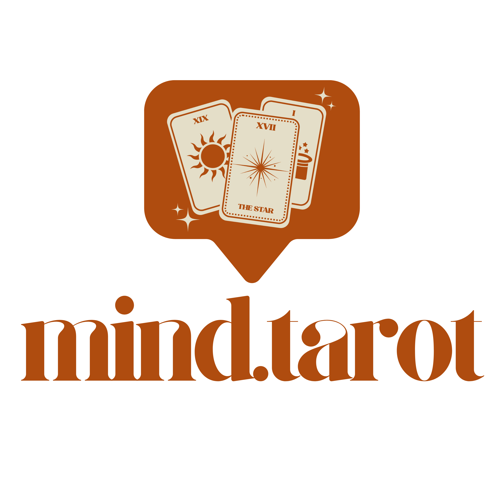

## Hi, I'm Phuvatat

Flutter & Firebase developer. Self-taught. Based in Thailand, working internationally.

I build real products from architecture to deployment. My main project — **MindTarot** — is live on Google Play and App Store.

  &nbsp;
  

### What I build

**[MindTarot](https://mindtarotapp.com)** — Introspective tarot app with AI-powered interpretations.
Built from scratch to store: authentication, payments, AI pipeline, 3 languages, Clean Architecture.

 

`Flutter` `Firebase` `Gemini AI` `RevenueCat` `Cloud Functions` `Clean Architecture`

### Stack

  
  
  
  
  
  

### Links

- [Portfolio](https://phuvatatdev.github.io/portfolio) — scroll-animated one-page site (Astro + GSAP)
- [MindTarot](https://mindtarotapp.com) — live product
- [LinkedIn](https://linkedin.com/in/phuvatat)
- Email: pvtdev.app@gmail.com
